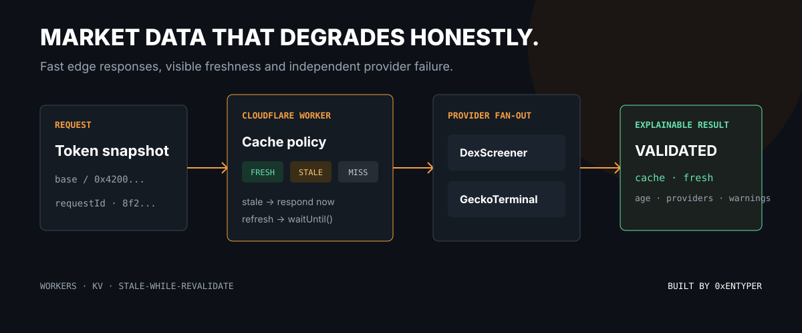
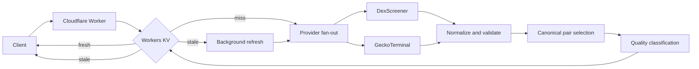
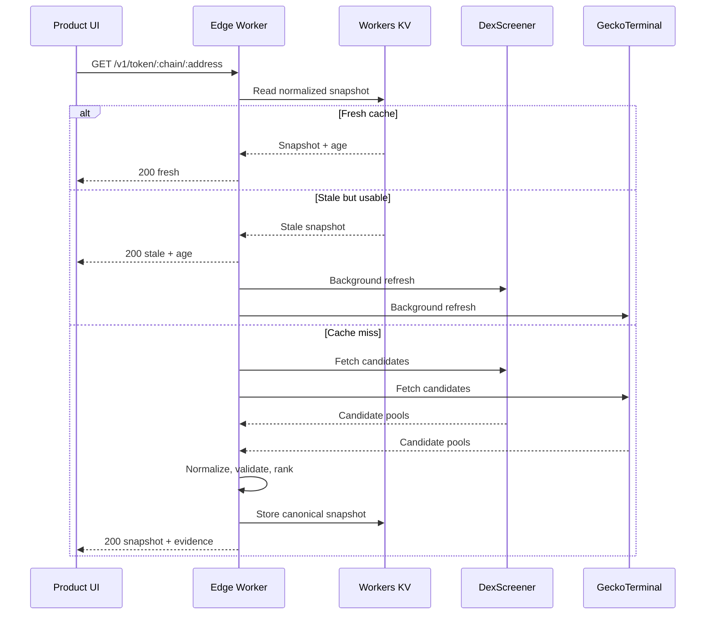

<div align="center">

# Onchain Market Data Pipeline

### A Cloudflare Worker reference for normalizing unreliable multi-provider token data into an explainable edge API.

   

[](https://github.com/0xENTYPER/onchain-market-data-pipeline/actions/workflows/ci.yml)

</div>

This repository demonstrates the backend layer behind a trustworthy multi-chain market interface: provider fan-out, normalization, canonical-pair selection, explicit MCAP/FDV semantics, edge caching, stale-while-revalidate, and visible data-quality states.

It is a runnable reference implementation, not production PNLFlex or Baggy source code. Private routes, credentials, paid providers, storage IDs, ranking configuration, and operational controls remain private.



## At a glance

| Surface | Implementation | Why it matters |
| --- | --- | --- |
| Runtime | Cloudflare Worker | Provider latency is absorbed near the consumer |
| Sources | DexScreener + GeckoTerminal | One outage does not erase every market |
| Cache | Workers KV with fresh/stale/hard-expired windows | Speed never hides the age of a snapshot |
| Selection | Deterministic candidate ranking | The same evidence produces the same pair |
| Valuation | Typed `market-cap` / `fdv` / `estimated` | Unlike-looking numbers are not silently mixed |
| Output | Quality, warnings, providers, request ID | The UI can explain confidence instead of guessing |

**Read by role:** product engineers can start with [Quality states](#quality-states), backend engineers with [Request lifecycle](#request-lifecycle), and reviewers with [Failure matrix](#failure-matrix) and [Verification](#verification).

## The problem

Onchain providers disagree in ways that directly affect product correctness:

- one token can have dozens of pools;
- providers return different metadata and images;
- the first pool is not necessarily the most representative one;
- market cap may be missing while FDV exists;
- APIs fail or rate-limit independently;
- an old but known response can be better than a blank screen;
- consumers need to know whether data is validated, partial, or degraded.

The pipeline converts that uncertainty into a stable API contract.

## Architecture



## Request lifecycle



The cache does not merely optimize a provider request. It is part of the product contract: every path returns an explicit state and age, and only the stale path is allowed to continue asynchronously through `ctx.waitUntil()`.

## API

```text
GET /health
GET /v1/token/:chain/:address
```

Example:

```bash
curl http://localhost:8787/v1/token/base/0x4200000000000000000000000000000000000006
```

Every successful response includes the market snapshot, cache state, age, quality, providers, warnings, and a request ID:

```json
{
  "data": {
    "chain": "base",
    "symbol": "WETH",
    "priceUsd": 2663.3,
    "capitalization": {
      "kind": "market-cap",
      "usd": 701368898
    },
    "quality": "validated",
    "providers": ["dex-screener", "gecko-terminal"],
    "warnings": []
  },
  "cache": {
    "state": "fresh",
    "ageSeconds": 8
  },
  "requestId": "..."
}
```

Values in the example are illustrative and change with the market.

## Cache policy

| State | Behavior | Product meaning |
| --- | --- | --- |
| `fresh` | Return KV snapshot immediately | Recently refreshed data |
| `stale` | Return known snapshot and refresh with `ctx.waitUntil()` | Usable fallback with visible age |
| `miss` | Await providers before responding | No safe cached value exists |
| hard expired | Ignore the cache record | Old data must not silently survive |

KV is used through a Worker binding, not through Cloudflare's REST API. Cache writes are awaited when the response depends on them, while stale refreshes are explicitly passed to `ctx.waitUntil()`.

## Quality states

- **`validated`**: usable price, at least $100K canonical-pair liquidity, and more than one provider returned candidates.
- **`partial`**: usable price and at least $10K liquidity, but provider agreement or depth is limited.
- **`degraded`**: a result exists, but liquidity or pricing evidence is weak.

Quality is not a token safety score. It describes the evidence supporting the selected market snapshot.

### Response anatomy

| Field | Origin | Consumer decision |
| --- | --- | --- |
| `priceUsd` | Canonical pair | Draw the current quote and chart anchor |
| `capitalization.kind` | Provider field or explicit estimate | Label MCAP, FDV, or estimate correctly |
| `providers` | Successful adapters | Explain source coverage |
| `quality` | Evidence classifier | Choose full, warning, or degraded UI state |
| `warnings` | Validation and fallback stages | Show what is incomplete without blocking usable data |
| `cache.ageSeconds` | KV record timestamp | Display freshness and decide whether to refresh |
| `requestId` | Worker entry point | Connect a user report to structured logs |

## Selection trace

The ranking stage keeps market choice inspectable. It does not select the first API item or simply the pool with the highest headline number.

```text
candidate pools
  -> reject malformed price and unsupported chain
  -> normalize token orientation and quote currency
  -> compare liquidity and trading activity
  -> prefer stronger metadata and provider agreement
  -> select one canonical pair
  -> classify valuation and quality
```

The implementation is split between [`src/providers.ts`](src/providers.ts), [`src/validation.ts`](src/validation.ts), and [`src/pipeline.ts`](src/pipeline.ts), so provider parsing cannot quietly redefine product semantics.

## Failure behavior

The providers run with `Promise.allSettled()`. One timeout does not erase a usable result from another source. Provider failure is reflected in warnings and structured logs. If every source fails and no stale cache remains, the API returns `503 providers_unavailable` with a request ID.

## Failure matrix

| Cache | Providers | HTTP result | User-visible meaning |
| --- | --- | --- | --- |
| Fresh | Not called | `200` | Current cached snapshot |
| Stale | Refresh succeeds | `200` immediately | Known snapshot, refresh in progress |
| Stale | Refresh fails | `200` immediately | Known snapshot with age and warning |
| Miss | One succeeds | `200` | Partial provider coverage |
| Miss | All fail | `503` | No defensible market snapshot |
| Hard expired | All fail | `503` | Old data is not presented as current truth |

Representative structured event:

```json
{
  "event": "market_refresh",
  "requestId": "0b56...",
  "chain": "base",
  "providers": ["dex-screener"],
  "quality": "partial",
  "warnings": ["gecko-terminal unavailable"]
}
```

This is deliberately low-cardinality operational context. Addresses and verbose provider payloads do not need to become log noise.

## Cloudflare design decisions

| Decision | Reason |
| --- | --- |
| Worker binding for KV | Avoid REST authentication and an unnecessary network hop |
| Generated `Env` types | Keep code aligned with `wrangler.jsonc` bindings |
| `ctx.waitUntil()` for stale refresh | Return known data quickly while completing background work |
| Structured JSON logs | Make provider and refresh failures searchable |
| No request state in module globals | Worker isolates are reused across requests |
| `crypto.randomUUID()` request IDs | Use Web Crypto rather than predictable identifiers |
| Explicit hard expiry | Prevent stale data from becoming permanent truth |
| `no-store` client response | The API exposes its own freshness policy explicitly |

## Local development

```bash
npm install
npm run types
npm run check
npm test
npm run dev
```

Before deployment, create a KV namespace and replace the placeholder ID in `wrangler.jsonc`:

```bash
npx wrangler kv namespace create MARKET_CACHE
npx wrangler deploy
```

Secrets belong in Wrangler secrets or managed bindings, never in source control.

## Verification

The repository checks:

- strict TypeScript;
- generated Worker binding types;
- provider fallback behavior;
- canonical-pair selection;
- MCAP/FDV separation;
- metadata fallback behavior;
- fresh and stale cache boundaries;
- a Wrangler dry-run bundle.

```bash
npm run types
npm run check
npm test
npm run build
```

## Repository map

| Path | Responsibility |
| --- | --- |
| [`src/index.ts`](src/index.ts) | HTTP routing, request IDs, cache orchestration |
| [`src/cache.ts`](src/cache.ts) | Fresh, stale, and hard-expiry decisions |
| [`src/providers.ts`](src/providers.ts) | External source adapters |
| [`src/pipeline.ts`](src/pipeline.ts) | Fan-out, normalization, ranking, quality |
| [`src/model.ts`](src/model.ts) | Stable API and provider contracts |
| [`test/pipeline.test.ts`](test/pipeline.test.ts) | Provider disagreement and fallback scenarios |
| [`test/cache.test.ts`](test/cache.test.ts) | Boundary behavior for every cache state |

## What this case study demonstrates

- designing a stable product contract over unstable third-party APIs;
- Cloudflare Worker lifecycle and KV usage without hidden REST hops;
- graceful degradation that remains visible to the user;
- explicit valuation semantics instead of interchangeable MCAP/FDV labels;
- testable boundaries between transport, normalization, selection, and presentation.

## References

- [Cloudflare Workers best practices](https://developers.cloudflare.com/workers/best-practices/workers-best-practices/)
- [Workers KV read API](https://developers.cloudflare.com/kv/api/read-key-value-pairs/)
- [Workers KV write API](https://developers.cloudflare.com/kv/api/write-key-value-pairs/)
- [Wrangler configuration](https://developers.cloudflare.com/workers/wrangler/configuration/)
- [DexScreener API](https://docs.dexscreener.com/api/reference)
- [GeckoTerminal API](https://apiguide.geckoterminal.com/)

## Repository scope

This reference uses free public market-data endpoints and a placeholder KV namespace. It does not claim production SLA, audit status, token safety, or valuation accuracy. Provider terms and rate limits remain the responsibility of the deployer.

## Author

Built by [0xENTYPER](https://github.com/0xENTYPER).
